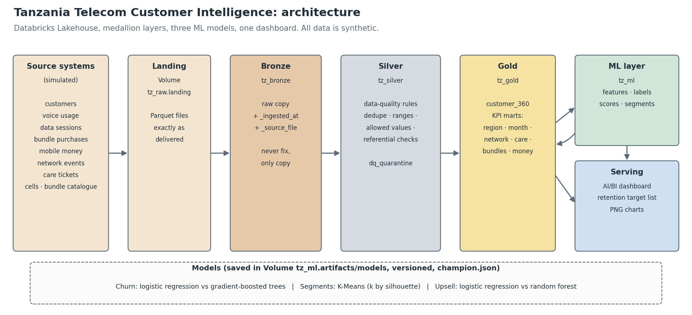

# Architecture

## Layers

| Layer | Schema | Rule |
|---|---|---|
| Landing | `tz_raw` (Volume `landing`) | Files exactly as the (simulated) source systems deliver them |
| Bronze | `tz_bronze` | Copy landing 1:1, add `_ingested_at` and `_source_file`. Never fix, never drop. |
| Silver | `tz_silver` | Apply declarative data-quality rules. Pass → Silver table. Fail → `dq_quarantine` with reasons. |
| Gold | `tz_gold` | `customer_360` + business-ready KPI marts, one clean `SELECT` away from any dashboard chart. |
| ML | `tz_ml` | Features, labels, scores, segments, recommendations. Models are files in Volume `tz_ml.artifacts/models`. |

## Why this shape

* **Bronze keeps the untouched original.** If a Silver rule turns out to be wrong, Silver can be rebuilt from Bronze
  without re-ingesting anything.
* **Silver never silently deletes.** Every rejected row is in `dq_quarantine` with the rule(s) it broke, so a data
  owner can go fix the source system instead of wondering where 2% of rows went.
* **Gold is deliberately small and pre-aggregated.** Dashboard charts should never need a join across millions of
  rows at click time — that work happens once, in `80_build_kpi_marts.py`.
* **ML artifacts are versioned files, not just Delta tables.** `models/<task>/versions/<version>/` plus a
  `champion.json` pointer means a new model version can be trained and compared without overwriting the one
  currently used in production; rolling back is copying the pointer back.

See `docs/images/data_model.png` for the source-table entity relationships, `docs/data_dictionary.md` for every
column, and `docs/runbook.md` for the notebook run order and job scheduling.
